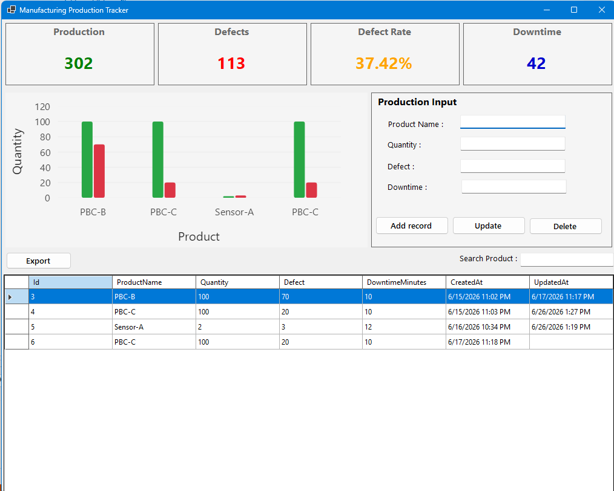

# Manufacturing Production Tracker

A Windows Forms desktop application for tracking manufacturing production data. The system enables users to manage production records, monitor key performance indicators (KPIs), visualize production trends, and export reports to Excel.

## Dashboard Preview



---

## Features

* 📊 Real-time Manufacturing Dashboard
* ➕ Add production records
* ✏️ Update existing records
* 🗑️ Delete records
* 🔍 Search products instantly
* 📈 Interactive production chart using LiveCharts2
* 📋 KPI Dashboard

  * Total Production
  * Total Defects
  * Defect Rate (%)
  * Total Downtime
* 📄 Export production data to Microsoft Excel (.xlsx)

---

## Technologies Used

* C#
* .NET 8 Windows Forms
* Microsoft SQL Server
* Microsoft.Data.SqlClient
* LiveCharts2
* EPPlus
* Visual Studio 2022

---

## Database Setup

1. Open SQL Server Management Studio (SSMS).
2. Execute the SQL script located at:

```
Database/DatabaseSetup.sql
```

This script will:

* Create the `ManufacturingDB` database
* Create the `Production` table
* Insert sample production records

---

## Configure the Database Connection

Open **App.config** and update the SQL Server instance.

Example:

```xml
Server=YOUR_SQL_SERVER;
```

Replace it with your SQL Server instance, for example:

```xml
Server=localhost\SQLEXPRESS;
```

or

```xml
Server=.\SQLEXPRESS;
```

---

## How to Run

### Option 1 — Visual Studio

1. Clone the repository.
2. Restore NuGet packages.
3. Configure the SQL Server connection.
4. Execute `DatabaseSetup.sql`.
5. Run the project.

### Option 2 — Published Application

1. Download the latest release.
2. Extract the ZIP file.
3. Configure `App.config` if required.
4. Run `ManufacturingTracker.exe`.

---

## Project Structure

```
ManufacturingTracker
│
├── Database
│   └── DatabaseSetup.sql
│
├── ManufacturingTracker
│   ├── Form1.cs
│   ├── DatabaseHelper.cs
│   ├── App.config
│   └── ...
│
├── dashboard.png
├── README.md
└── ManufacturingTracker.sln
```

---

## Future Improvements

* Date range filtering
* Production history reports
* User authentication
* Dark mode
* PDF report export
* Dashboard trend analytics

---

## Author

**S Chi**

This project was developed as a personal learning project to strengthen skills in C#, Windows Forms, SQL Server, dashboard development, and desktop application design.
